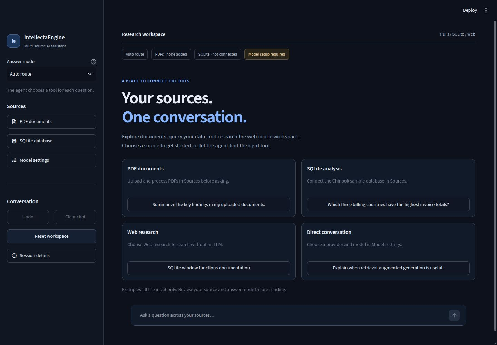
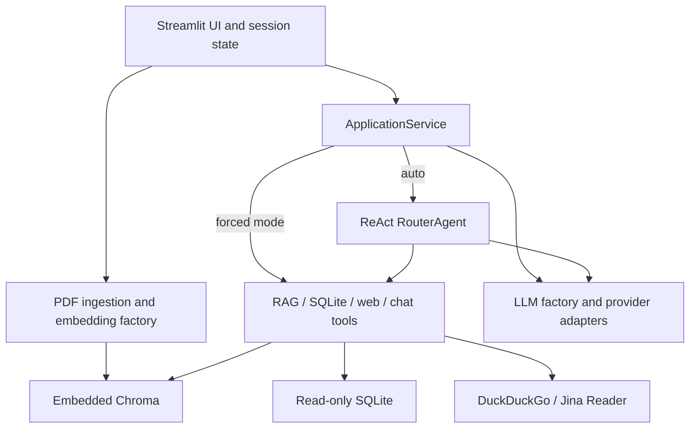

# IntellectaEngine

**Agentic AI Platform & Multi-Source RAG** — a personal engineering portfolio project.

Ask questions across PDFs, a local SQLite database, and public web evidence in one
Streamlit workspace. For example, review a project brief, explore sample sales
figures, and research a related topic without switching applications. Choose a
specific tool or let a ReAct agent route the question.



*Real Chromium capture with empty credentials; no model inference or scripted
answers. [Capture provenance and walkthrough](docs/demo.md).*

## Capabilities and engineering

- **PDF RAG:** bounded extraction and chunking, embedded Chroma, MMR retrieval,
  and source/page references for the context supplied to the model.
- **SQLite analysis:** natural-language questions through a tool-calling agent;
  native read-only authorization, approved file paths, and execution/result limits.
- **Web evidence:** DuckDuckGo search and Jina Reader; validated URLs, bounded
  observations, and bounded reader responses. Forced web requires no LLM.
- **Conversation:** direct chat or automatic routing, with session-owned history,
  clear/reset/undo, and one final question/reply commit per completed submission.
- **Headless dispatch:** `ApplicationService` works without Streamlit. Offline tests
  exercise real routing/tool boundaries, failure handling, and resource cleanup.
- **Repeatable installation:** an installable wheel, Python 3.12, a uv lockfile,
  strict distribution checks, and a local non-root Docker workflow.

| Area | Technology |
| --- | --- |
| Interface and orchestration | Streamlit, LangChain ReAct / tool-calling agents |
| Documents and storage | pypdf, Chroma, SQLite |
| Model adapters | Gemini, Groq, OpenAI, Ollama |
| Embeddings | Hugging Face, FastEmbed, Gemini, OpenAI |
| Checks and packaging | pytest, Ruff, uv, setuptools, Docker |

## Architecture



LLMs power routing, chat, RAG generation, and SQL planning; forced web bypasses
LLM creation. The caller commits the final result to history, never the tools.
[Architecture and boundaries](docs/architecture.md) explains provider calls,
PDF replacement, session lifetime, and Jina's separate origin fetch.

```text
src/intellectaengine/
  core/         Dispatch, routing, factories, history, ingestion, SQL/web policies
  connectors/   PDF extraction, vector storage, database metadata
  tools/        RAG, SQLite, web, chat
  ui/           Streamlit layout, sidebar, chat, session state
  assets/       Reviewed Chinook.db
  streamlit_app.py
examples/       Fictional PDF, editable source, verified analytical queries
docs/           Architecture, development, demo, screenshots
tests/          Offline unit and integration checks
scripts/        Distribution/container checks and PDF generation
```

## Local quickstart

Supported baseline: **Linux, CPython 3.12, uv 0.12.2**. From your checkout:

```bash
python3 -m pip install --user 'uv==0.12.2'
uv python install 3.12
uv sync --locked
# Create configuration only if it does not already exist:
test -e .env || cp .env.example .env
# Edit .env to select your provider/model and supply its required credentials.
uv run --frozen intellectaengine
```

Open [localhost:8501](http://localhost:8501). Initial rendering needs no credentials
or model downloads. Dependency installation needs network access. If system Python
is externally managed, install pinned uv in a separate virtual environment.

For actual answers, configure one LLM provider: Gemini (`GOOGLE_API_KEY`), Groq
(`GROQ_API_KEY`), OpenAI (`OPENAI_API_KEY`), or an already running Ollama server
(`OLLAMA_BASE_URL`) with an already installed model. Set `DEFAULT_LLM_PROVIDER`
and the corresponding `DEFAULT_*_MODEL`. Model names in the template are editable
suggestions, not verified current service availability. SQL requires native tool
calling; automatic routing requires adherence to the ReAct format.

PDF processing also needs an embedding provider. Local Hugging Face/FastEmbed
models may download weights on first use; hosted embeddings require their own
credentials and send document content to that provider. LLM requests can disclose
questions, retrieved text, history, or SQL observations to the selected provider.
Web mode sends queries to DuckDuckGo or target URLs to Jina.

Settings load at startup: process environment overrides the working-directory
`.env`. Restart after edits. See [.env.example](.env.example) and the
[configuration and capability details](docs/development.md#configuration-and-provider-capabilities-phase-3).
Custom databases require approved absolute paths; the sample needs no extra setup.

## Docker / Compose

With Docker and Compose 2.24+ on Linux amd64:

```bash
docker compose --env-file /dev/null up --build -d
docker compose --env-file /dev/null logs --tail=50 app
docker compose --env-file /dev/null down
```

Open [localhost:8501](http://localhost:8501). Optional `container.env` supplies
runtime settings/keys; it is never included in the image. Use container paths for
storage/custom databases. To run without Compose:

```bash
docker build -t intellectaengine:local .
docker run -d --name intellectaengine -p 127.0.0.1:8501:8501 \
  --mount source=intellecta-chroma,target=/data/chroma \
  --mount source=intellecta-models,target=/home/app/.cache \
  intellectaengine:local
docker stop -t 20 intellectaengine
docker rm intellectaengine
```

Named volumes preserve Chroma files and model caches, **not chat sessions, upload
bytes, or active document handles**. Re-upload after a new session; this is not a
saved document library. Compose `down -v` deletes its volumes. Direct Docker and
Compose use different volume names. Builds/startup do not download model weights.
See [container configuration, mounts, and Ollama](docs/development.md#docker-workflow-phase-8).

## Try it

1. Expand **Sources → PDF documents**, upload [field-notes.pdf](examples/field-notes.pdf), click **Process PDFs**, and
   choose **PDF documents**. Ask: “How many kits are in the pilot, and how
   long can each be borrowed?” Then ask: “What is the pilot's total budget?”
   The latter is deliberately absent.
2. Expand **Sources → SQLite database**, select **Use Chinook sample database**, click **Connect**, choose
   **SQLite database**, and ask: “Which three billing countries have the
   highest invoice totals?”
3. With network access, choose **Web research** and enter a public-topic
   search such as “SQLite window functions documentation”. Live web results vary.

[Reference facts and SQL](examples/README.md) are verified fixture answers, not
recorded LLM outputs. The [demo guide](docs/demo.md) separates the offline browser
walkthrough from user-run live inference.

## Checks

```bash
uv run --frozen pytest
uv run --frozen ruff check .
uv run --frozen ruff check tests --select E4,E7,E9,F
uv run --frozen ruff format --check tests
uv run --frozen python -m pip check
uv build
uv run --frozen python scripts/check_distribution.py --offline
```

The distribution check needs cached build/dependency artifacts for `--offline`.
Tests isolate configuration, block Internet sockets, and use fake models/embeddings.
See [development instructions](docs/development.md) for export consistency,
container smoke checks, CI configuration, and scoped dependency advisories.

## Limits and attribution

This is a local synchronous application with embedded storage, not a public
multi-user service. It has no streaming UI or authentication layer. SQL support
is SQLite-only. In-process limits are not hostile-file sandboxes or hard
cancellation of every provider call. Jina controls its own origin resolution and
redirects. Retrieved references identify context locations, not claim verification.

Offline checks and local Docker smoke checks have passed. Browser evidence covers
startup and sample connection only; live providers, routing/retrieval quality,
and hosted GitHub Actions remain unverified. The completed [publication review](docs/release-readiness.md)
records conditional readiness and remaining publication gates.

Code and original fictional examples use the [MIT license](LICENSE). Chinook
retains its upstream license and attribution in [THIRD_PARTY_NOTICES.md](THIRD_PARTY_NOTICES.md).
Dependencies and separately downloaded model weights retain their own licenses.
