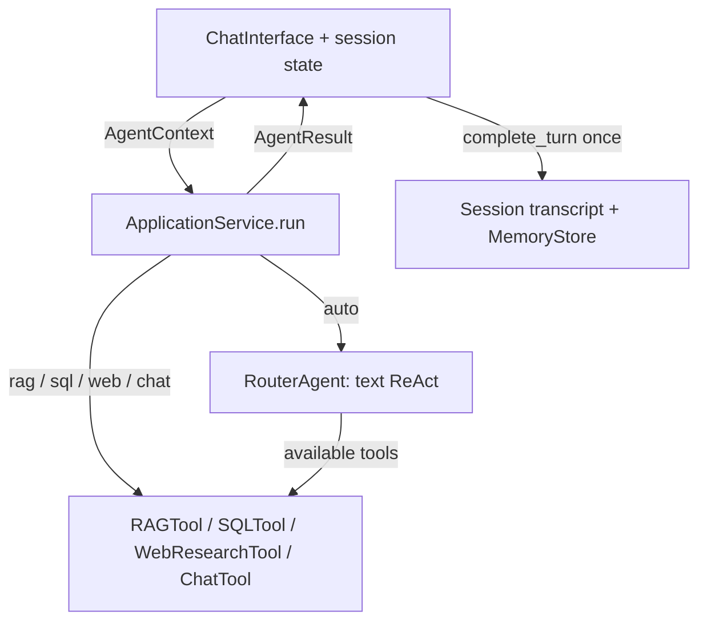
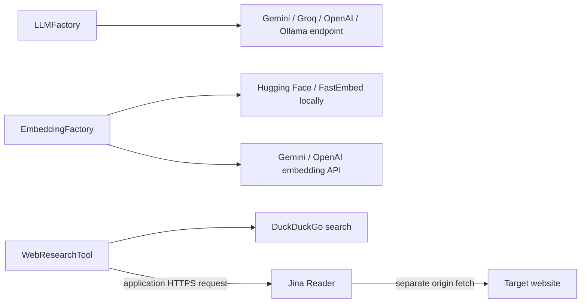
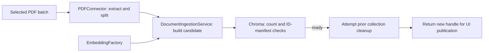

# Architecture

IntellectaEngine is a synchronous Python application. The Streamlit process hosts
its UI, orchestration, PDF extraction, and embedded storage access. There is no
separate API server, worker queue, or managed vector database.

## Request dispatch and ownership

[`ApplicationService.run`](../src/intellectaengine/core/application.py) accepts a
query, provider/model, mode, and `AgentContext`; it returns an `AgentResult` with
answer, tool, safe error code, and optional retrieved sources. Its imports do not
require Streamlit. Headless callers can inject an `llm_factory` and own their
history updates.

Forced modes bypass the outer router. RAG needs an active vector store; SQL
validates its database before constructing the model. **Forced web executes before
LLM creation**, so it needs neither model credentials nor a usable model name.
Auto mode creates an LLM and a local text ReAct agent. Missing-resource tools are
omitted; the model may use tools or answer directly. Routing accuracy is not
established by the offline tests.

The SQL tool runs a nested native tool-calling agent. Text ReAct itself does not
require native tool binding, but SQL does. Both executors have six-step and
60-second between-step limits; these cannot cancel a blocking provider call.
Typed tool failures terminate the request rather than becoming ordinary evidence
for another attempt. See [failure contracts](development.md#application-and-failure-boundary-phase-3).

[`ChatInterface`](../src/intellectaengine/ui/chat_interface.py) commits exactly one
complete question/final-reply pair through `SessionStateManager.complete_turn`.
Tools, the router, and the service never commit conversation history. Handled
failure replies are committed and undoable; interruption before a final result
commits nothing. This is ownership within a completed synchronous submission,
not durable exactly-once delivery across crashes.

Each session owns a visible transcript and a `MemoryStore` containing at most ten
complete turns. Auto routing and chat receive history; forced RAG/SQL/web receive
the current query only. Clear removes chat; undo rebuilds its model window; reset
also changes the session ID after successful document cleanup. See
[session lifecycle](development.md#conversation-ownership-and-lifecycle-phase-2).

## Tools and external boundaries

[`LLMFactory`](../src/intellectaengine/core/llm_factory.py) supplies clients for
routing, direct chat, RAG answer generation, and SQL planning. It validates the
selected provider and credentials without switching providers on failure.
[`EmbeddingFactory`](../src/intellectaengine/core/embedding_factory.py) supplies
local or hosted embeddings for ingestion and retrieval. Local embedding packages
are installed, but weights are not bundled; Ollama likewise needs a separately
running server and installed model. Adapter availability does not establish live
model capabilities or quality.

- **RAG:** MMR selects indexed chunks; the full inserted context is character
  bounded and labeled with filename/one-based page. Structured sources describe
  the supplied context, not whether every answer claim is supported.
- **SQLite:** `SQLitePolicy` opens a fresh native read-only connection per operation,
  applies an authorizer and VM/result limits, and closes it before model calls.
  Custom files must be existing approved paths. Only SQLite is supported; generic
  SQLAlchemy URI parsing is not general database-dialect support.
- **Web:** DuckDuckGo returns search evidence. `SCRAPE:<public-url>` sends a request
  to `https://r.jina.ai` with the target URL. **Jina fetches the origin separately**;
  application lexical URL checks cannot control its DNS resolution or origin
  redirects. Jina responses have byte/read/observation limits; DDGS owns its
  internal buffering and pagination. These are distinct network boundaries.
- **Chat:** invokes the selected model with the caller's bounded history.

Questions, history, retrieved text, and SQL results may cross the configured model
boundary. Hosted embedding providers receive document text; search providers
receive queries; Jina receives target URLs including query strings. Successful
content is not generally redacted. Detailed [SQL policy](development.md#sql-policy-and-lifecycle-phase-5)
and [web policy](development.md#web-search-and-jina-reader-phase-6) document limits.

## PDF ingestion and Chroma lifecycle

The sidebar explicitly submits a batch to
[`DocumentIngestionService.replace`](../src/intellectaengine/core/document_ingestion.py).
`PDFConnector` bounds upload bytes, file/page attempts, and produced chunks. It
extracts text with pypdf; scanned images without text need preprocessing elsewhere.
Filenames are display metadata, never destination paths. Original upload bytes
are not persisted by the ingestion service.

Replacement builds a separate embedded Chroma collection. Compatibility includes
session, content hashes, embedding configuration, splitter settings, and format.
A building/ready marker plus chunk count and sorted-ID manifest prevent reopening
an incomplete collection. Identical compatible batches can reopen without
re-embedding. Reopen needs an explicit session-owned `DocumentSet`; there is no
cross-session discovery feature.

A batch with no usable text or failed indexing retains the previous active handle.
A partially usable batch can succeed with a per-file report. After successful
creation the service attempts old-index cleanup and returns a new handle for the
UI to publish; cleanup failure is reported. Clear/reset verify collection deletion
before dropping session references. This is **replace-on-success**, not an atomic
on-disk transaction: a crash or failed cleanup can leave an inactive collection.
See [ingestion lifecycle details](development.md#pdf-ingestion-retrieval-and-index-lifecycle-phase-4).

## Tradeoffs and evidence

| Choice | Consequence |
| --- | --- |
| Synchronous Streamlit process | Simple local workflow; blocking calls hold up a session. No async UI or streaming. |
| Embedded Chroma and local SQLite | No external database service; local ownership, backups, and interrupted cleanup remain operator concerns. |
| SQLite-only SQL enforcement | Native authorizer and budgets can be tested against the actual engine; remote dialects are deliberately unsupported. |
| Replace-on-success PDFs | Failed processing preserves usable prior context; disk cleanup is not a crash-safe transaction. |
| Session-owned history and handles | Sessions stay isolated; persistent index files do not restore chat or a document library after restart. |
| Offline boundary tests | Real executors, SQLite, temporary Chroma, and UI contracts can be checked without paid calls; live-model behavior remains unverified. |

Disk persistence and session lifetime are separate. Chroma/model-cache volumes
survive container recreation, but the in-memory transcript, active handle, and
upload bytes do not. No authentication or general multi-user hosting guarantee is
provided. Browser captures, AppTest coverage, and live-provider checks are
[reported separately](demo.md#what-the-evidence-shows).
