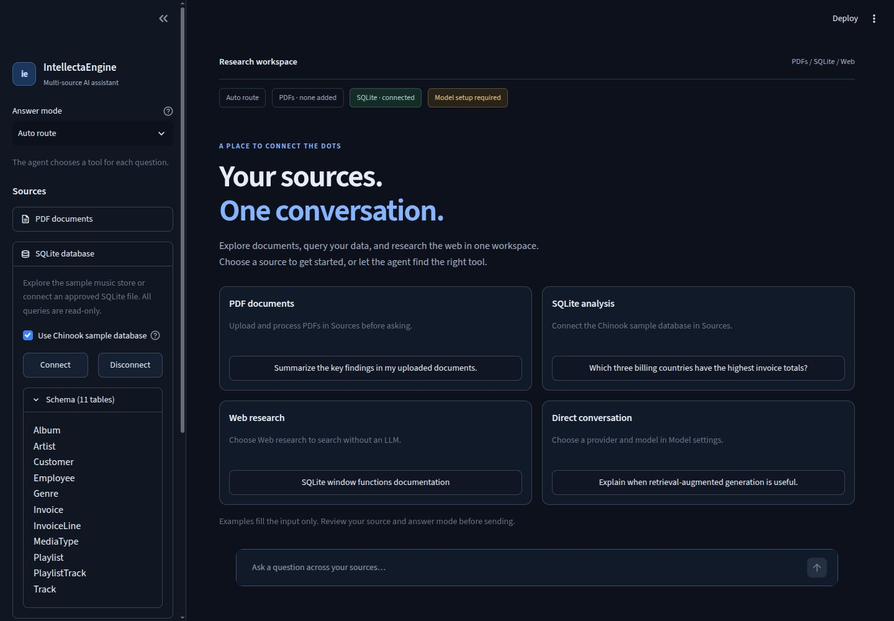

# Demonstration guide

The screenshots show the real Streamlit application in Chromium with isolated
configuration, empty credentials, and no model downloads or application web
searches. There is no scripted provider, fake answer, mock UI, or product demo mode.

## Browser captures


*Overview: normal startup, compact source/settings panels, editable example prompts,
and session-derived status. “Model setup required” reflects missing credentials;
configured credentials would not establish provider availability.*



*Sample connection: expanded SQLite controls and the real 11-table schema.
No SQL answer is shown and no LLM was invoked.*

Updated on 2026-10-03 (Africa/Casablanca), using the Codex in-app Chromium browser
at a 1440 × 1000 viewport on Linux with the locked Python 3.12 environment.
PNGs are unmodified viewport captures of the real app. The server ran in a temporary
empty working directory and temporary home, with only the repository theme copied
in, an empty process environment, offline model flags, and usage statistics disabled.
The checkout's private `.env` was not loaded. The UI no longer imports external
Google Fonts; it uses Streamlit's bundled font. Screenshots contain no private paths,
credentials, or user data.

The redesign was also inspected at 390 × 844: cards stack, the sidebar opens as a
panel, and the page has no horizontal overflow. Browser interactions checked example
prefill without submission, answer-mode selection, the genuine missing-credentials
failure and undo, and sample database connect/schema/disconnect/reconnect/reset.
No successful model answer, PDF processing, or live web search is claimed.

The focused regression run passed **155 tests** covering UI configuration,
conversation flows, SQL policy, document lifecycle, memory, startup, and publication
checks. Ruff correctness checks and test formatting passed. The full suite and
Docker rebuild were not repeated for this UI change; live-provider behavior remains
unverified.

## Workspace controls

- **Answer mode** selects automatic routing or a specific tool.
- **Sources → PDF documents** uploads, processes, and clears PDFs.
- **Sources → SQLite database** connects the bundled sample or an approved file.
- **Model settings** contains provider, editable model, and embedding selections.
- Example buttons only fill the chat input; edit the draft and send explicitly.
- **Undo** removes the last pair; **Clear chat** clears conversation history;
  **Reset workspace** also removes the active index after verified deletion,
  disconnects SQLite, and restores settings.
- Retrieved sources expand beneath an answer. They identify context locations,
  not independently verified claims.

## Reproduce the offline browser walkthrough

After the [local installation](../README.md#local-quickstart), run these Bash
commands **from the checkout**. They start the normal installed application in a
separate configuration directory; no development wrapper changes its behavior.

```bash
project_dir="$PWD"
demo_dir="$(mktemp -d /tmp/intellecta-browser-XXXXXX)"
mkdir -p "$demo_dir/home" "$demo_dir/.streamlit"
cp .streamlit/config.toml "$demo_dir/.streamlit/config.toml"
cd "$demo_dir"
env -i PATH=/usr/bin:/bin HOME="$demo_dir/home" \
  HF_HUB_OFFLINE=1 TRANSFORMERS_OFFLINE=1 HF_HOME="$demo_dir/hf" \
  LANGSMITH_TRACING=false STREAMLIT_BROWSER_GATHER_USAGE_STATS=false \
  "$project_dir/.venv/bin/intellectaengine" \
  --server.address=127.0.0.1 --server.port=8519 \
  --server.headless=true --server.fileWatcherType=none
```

Open [127.0.0.1:8519](http://127.0.0.1:8519) in a fresh browser profile. Capture the
overview, expand **Sources → SQLite database**, check **Use Chinook sample
database**, click **Connect**, and expand **Schema (11 tables)**. This performs
real policy-protected schema discovery without a provider. Disconnect/reconnect
and reset should update the controls. Do not process PDFs, submit a chat question,
or invoke web research in this no-provider walkthrough. Stop the server with
Ctrl-C when finished; the temporary directory contains only demonstration state.

For an automated reproduction of the desktop capture sequence, use
[`scripts/capture_demo.cjs`](../scripts/capture_demo.cjs) in a second terminal from
the checkout. It blocks external browser requests, waits for widget readiness,
checks draft-only examples and schema/disconnect/reset behavior, and writes the
two PNGs above. The updated script was syntax-checked; the UI walkthrough above
was performed through the in-app browser. It needs Node and an independently installed Playwright/Chromium; neither is a runtime
project dependency. With an existing Playwright installation:

```bash
PLAYWRIGHT_MODULE=/absolute/path/to/node_modules/playwright node scripts/capture_demo.cjs
```

If needed, provision authoring tools separately (network required for the browser
binary; this is not a model download):

```bash
npm install --prefix /tmp/intellecta-browser-tools playwright@1.62.1
/tmp/intellecta-browser-tools/node_modules/.bin/playwright install chromium
PLAYWRIGHT_MODULE=/tmp/intellecta-browser-tools/node_modules/playwright node scripts/capture_demo.cjs
```

Check resulting images for readability and disclosure before using them. Do not
paste a fabricated answer over the browser image. A future scripted-provider
capture must be visibly labeled and separately disclosed; none is used here.

## Short live demonstration (user-run, not verified here)

Use the regular configured application, not the isolated no-credential server.
Prepare a working provider/model before recording:

- An LLM credential for the selected hosted adapter, or a reachable Ollama server
  with an installed model. Confirm the model supports native tool calling for SQL
  and the ReAct format/generation options for automatic routing.
- For PDFs, an already cached local embedding model or valid hosted embedding
  credentials. First local use may download weights. Hosted services may charge
  for calls and receive the submitted content.
- Internet access for DuckDuckGo/Jina if demonstrating web research. Forced web
  needs no LLM; automatic routing to web does.

A three-minute sequence:

1. Upload [field-notes.pdf](../examples/field-notes.pdf), process it, and use
   **PDF documents**. Ask about kit counts and loan length. Compare the
   answer and retrieved pages with the [reference facts](../examples/README.md).
2. Ask the absent-budget question. Evaluate whether the model acknowledges the
   missing information; source references alone do not establish answerability.
3. Connect Chinook, choose **SQLite database**, and ask for the three countries
   with the highest invoice totals. Compare with the verified query references.
4. Optionally select **Auto route** and repeat a source-specific question to inspect
   routing, or select **Web research** for a public-topic search. Results
   depend on the live service/model and are not deterministic.
5. Use **Undo**, then **Clear chat**, to demonstrate session history controls. Full
   **Reset workspace** also clears the active PDF collection after verified deletion.

## What the evidence shows

| Evidence | Verified scope | Does not establish |
| --- | --- | --- |
| Browser screenshots and interactions | Actual startup, editable prompt drafts, missing-key failure/undo, sample schema and connection/reset controls, desktop/mobile layout | Live inference, PDF browser upload, real-model routing or retrieval quality |
| Streamlit AppTest suite | Widget/session flows with isolated fake models/tools | Browser rendering or live-provider compatibility |
| Example ingestion regression | Real PDF extraction and Chroma insertion with deterministic fake embeddings | Semantic embedding/retrieval quality |
| SQL reference regression | Exact analytical statements through the native read-only policy | Model-generated SQL quality |
| Scripted executor tests in the existing suite | Real ReAct/tool-calling plumbing with scripted model responses | A live inference demonstration |

Hosted GitHub Actions and live-provider demonstrations remain unverified. The
completed [publication review](release-readiness.md) records conditional readiness
and remaining publication gates; these assets do not constitute publication clearance.
